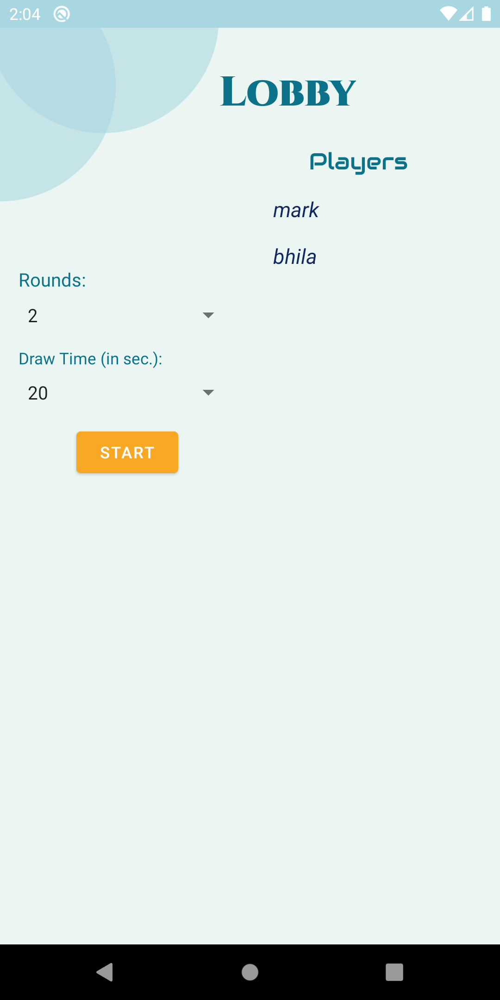
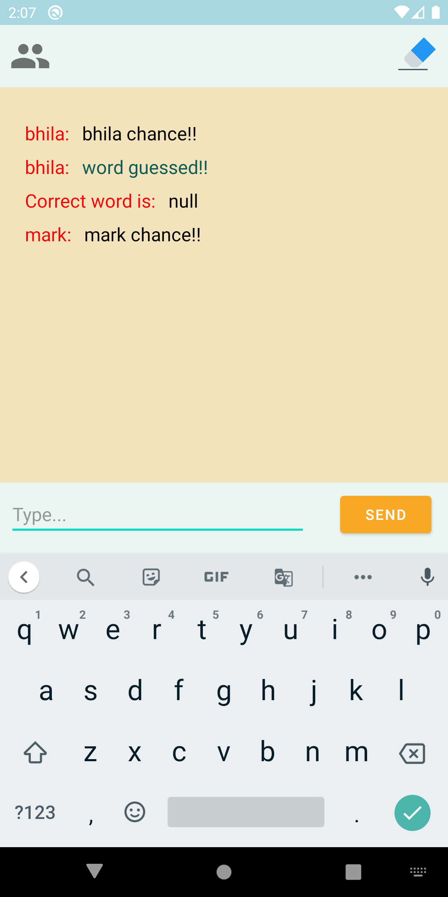
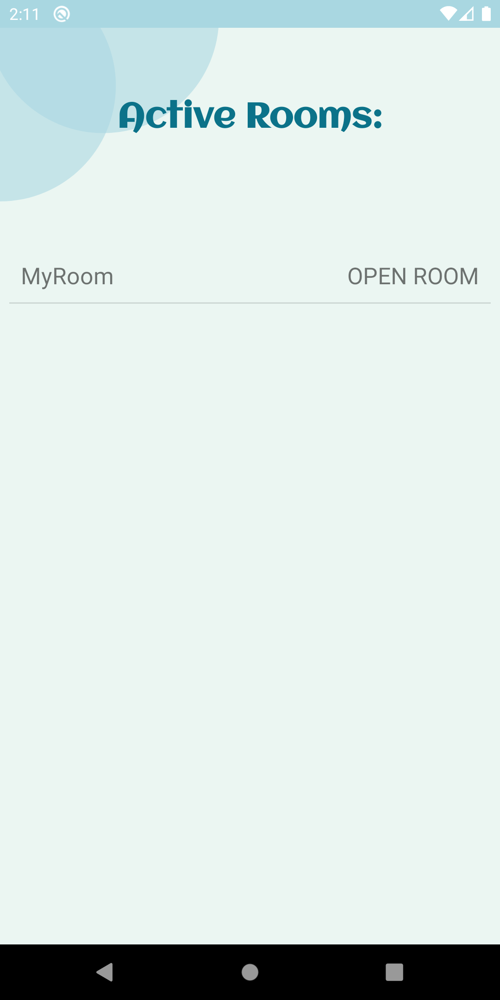

# Doodle war :smile:
Android Multiplayer Game of Drawing and Guessing. 

## All about Doodle war
Doodle is an Online Multiplayer Drawing Game it was developed for the toy hackathone organised by gov of india. In this you can Guess what your opponent is drawing and answer accordingly. You are awarded points for the correct answers and their is no negative markings for wrong answers. This time you can play online with your friends, other players around the World, or just guess the drawing or draw something for practice!
Use the Doodle war to draw on the screen while the app tracks and displays the sketch. Become part of the action as you interact with your sketch like charades while your opponents tries to guess as many clues as they can before time is up!

In the multiplayer mode, one player is selected as the artist, he is offered three words to choose from and his task is to draw the selected word. Other players try to guess what the artist is drawing. The winner is the player who first guesses the correct word.

## APPLICATION DISPLAY  :eyes:	
<kbd></kbd>
<kbd></kbd>
<kbd></kbd>
<kbd></kbd>
<kbd></kbd>

## Getting Started :+1:

These instructions will get you a copy of the project up and running on your local machine for development and testing purposes. See deployment for notes on how to deploy the project on a live system.

### Prerequisites

What things you need to install the software and how to install them

```
Things you need to install this mobile aplication->
1. Android Mobile
That's it!
```


## Built With :heartbeat:

* Android Studio
* Kotlin


## Contributing
Pull requests are welcome. For major changes, please open an issue first to discuss what you would like to change.

Please make sure to update tests as appropriate.

## License
[MIT](https://choosealicense.com/licenses/mit/)


